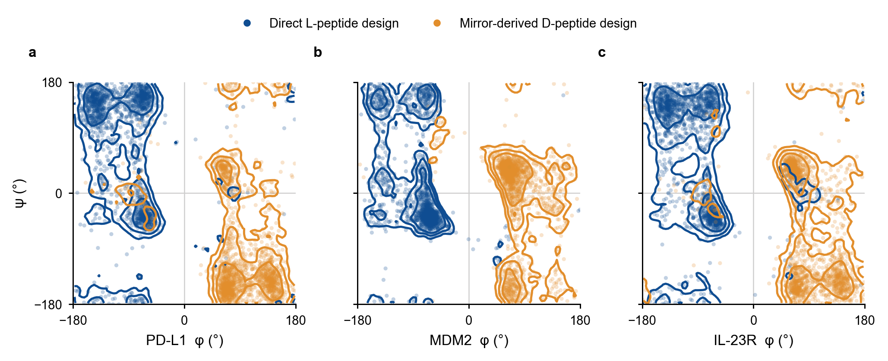
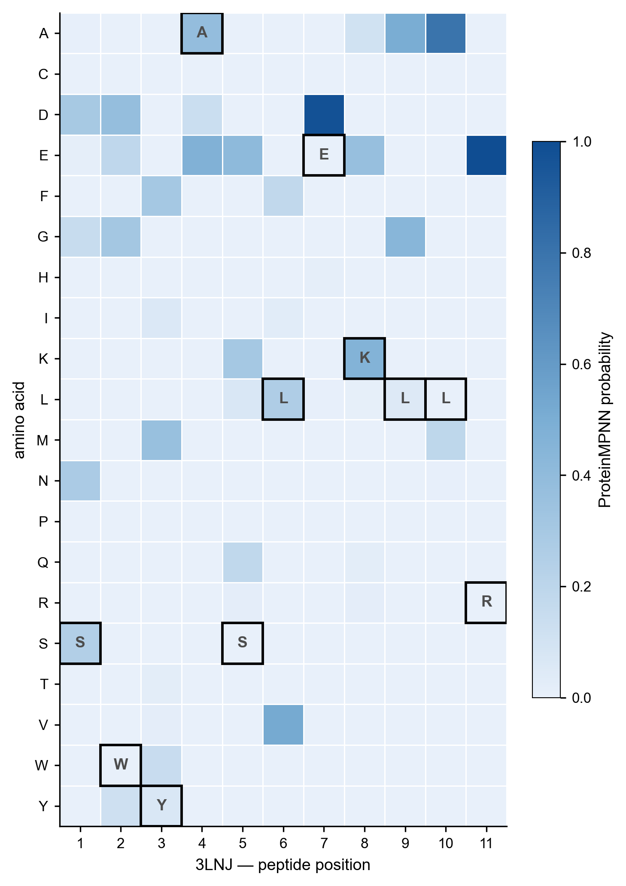
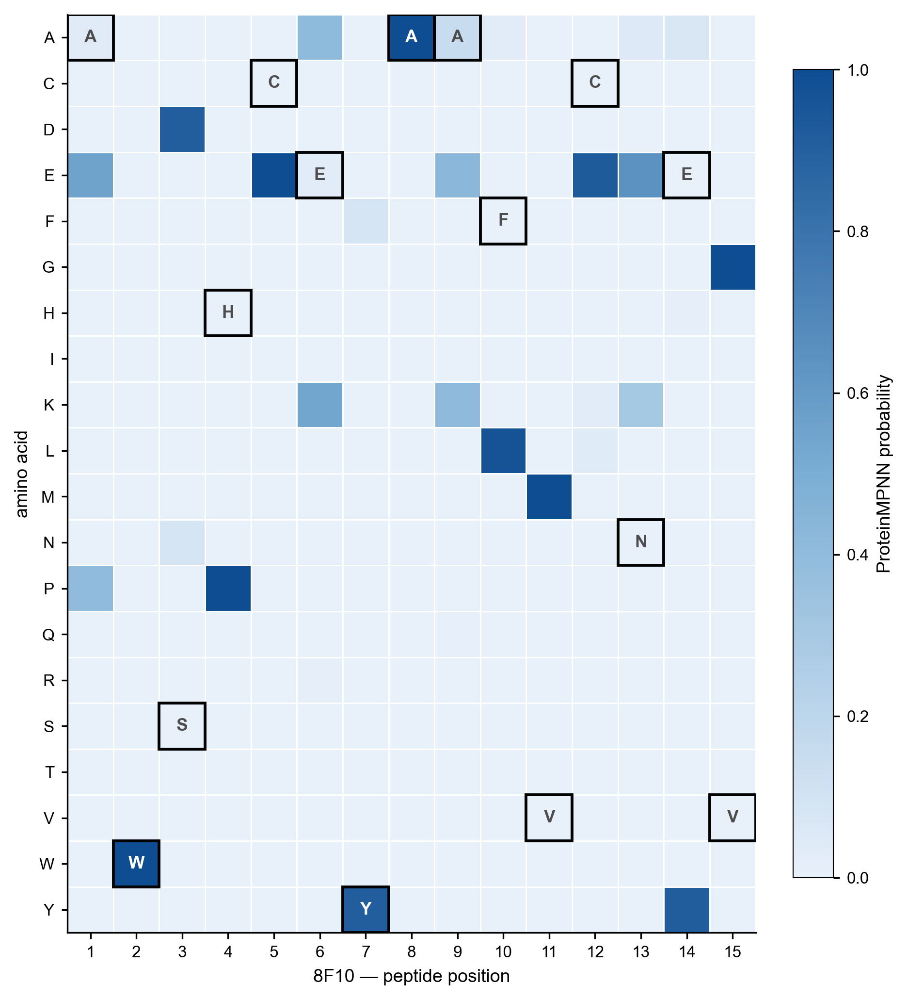
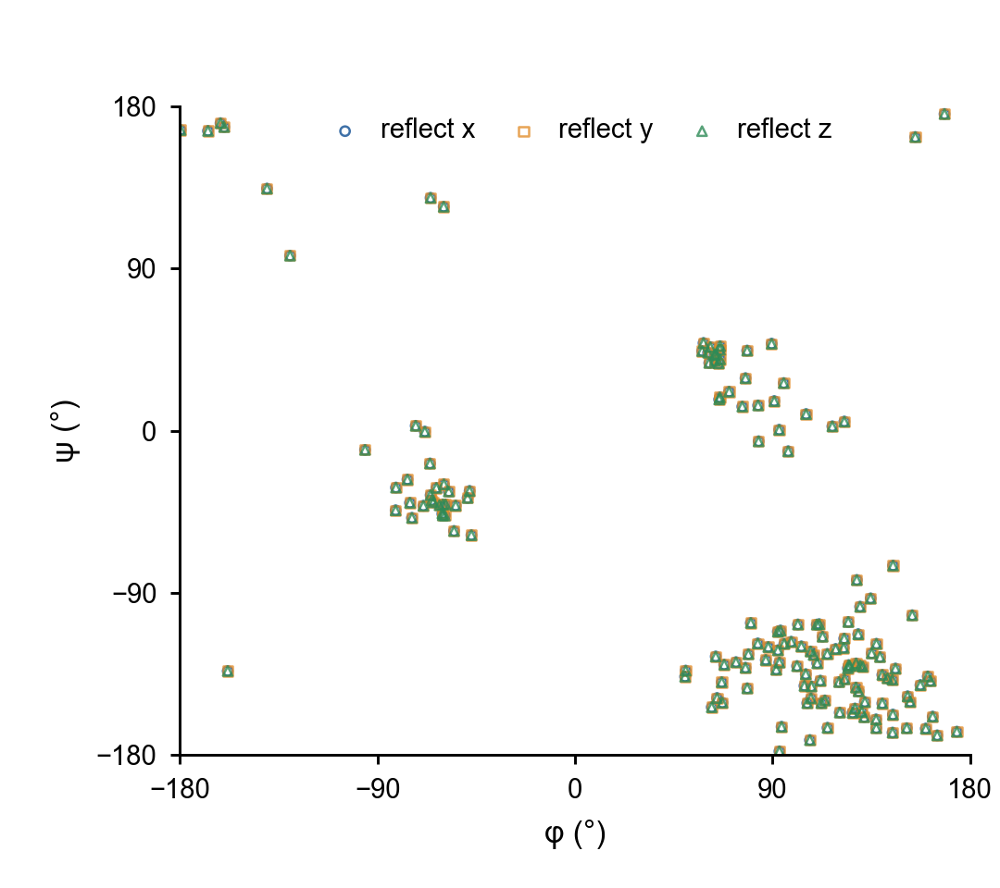
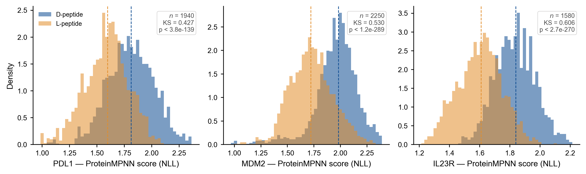
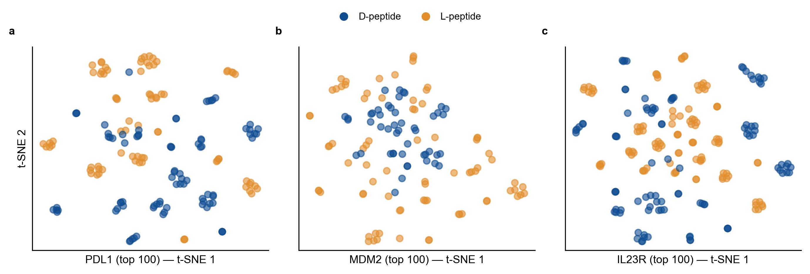
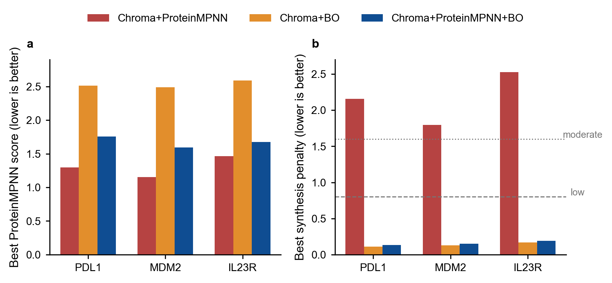
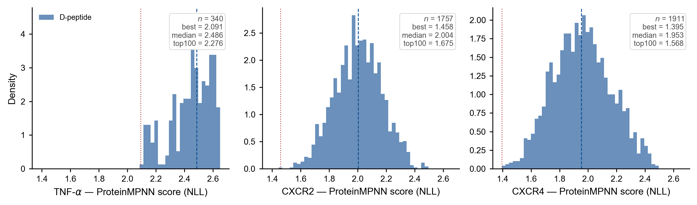

# Testing & Validation

## Contents

- [Quick self-checks](#quick-self-checks)
- [Mirror geometry QC](#mirror-geometry-qc)
- [ProteinMPNN sequence recovery](#proteinmpnn-sequence-recovery)
- [Mirror-axis equivalence](#mirror-axis-equivalence)
- [D- vs L-peptide design comparison](#d--vs-l-peptide-design-comparison)
- [Ablation: filtering + Bayesian Optimization](#ablation-filtering--bayesian-optimization)
- [New-target generalization](#new-target-generalization)

## Quick self-checks

```bash
# structural + plotting stack
python -c "from Bio.PDB import PDBParser; import openmm, pdbfixer, matplotlib, pandas; print('OK')"
# GPU + torch
python -c "import torch; print('CUDA', torch.cuda.is_available())"
# ProteinMPNN weights load
python -c "from utils.protein_mpnn import load_model; load_model(); print('MPNN OK')"
```

## Mirror geometry QC

Under a true mirror reflection the backbone dihedrals must satisfy **φ_D = −φ_L** and **ψ_D = −ψ_L** exactly.



| Target | L/D pose pairs | φ/ψ pairs checked | max \|φ_L + φ_D\| | max \|ψ_L + ψ_D\| |
|---|---:|---:|---:|---:|
| PD-L1 | 400 | 4,950 | **0.0** | **0.0** |
| MDM2 | 400 | 4,480 | **0.0** | **0.0** |
| IL-23R | 399 | 7,467 | **0.0** | **0.0** |
| TNFα | 399 | 5,073 | **0.0** | **0.0** |
| CXCR2 | 399 | 5,073 | **0.0** | **0.0** |
| CXCR4 | 399 | 5,073 | **0.0** | **0.0** |

Across **2,396 pose pairs** (30,114 dihedrals) the sum constraint holds to machine precision — `utils/pdb_processing.ld_convert` is a geometrically exact enantiomerization.

```bash
python benchmark/scripts/plot_phi_psi_mirror_qc.py
```
Data: [`data/fig_phi_psi_mirror_qc_summary.csv`](data/fig_phi_psi_mirror_qc_summary.csv).

## ProteinMPNN sequence recovery

Two deposited L-MDM2 / D-peptide crystal structures (PDB **3LNJ**, **8F10**) were reflected whole-complex along X into the virtual D-MDM2 / L-peptide frame; the mirrored MDM2 was fixed and the mirrored L-peptide redesigned with vanilla `v_48_020` at T = 0.1 (100 samples). A native L-complex (**3HTN**) redesigned *without* mirroring is the positive control.

| | |
|:--|:--|
|  |  |

| Structure (copy) | peptide len | sampled recovery (mean ± SD) | greedy | native MPNN score |
|---|---:|---:|---:|---:|
| **3HTN** (no-mirror control) | 139 | **0.51 ± 0.025** | 0.53 | 1.38 |
| 3LNJ_AB (mirrored) | 11 | 0.10 ± 0.06 | 0.09 | 2.65 |
| 3LNJ_CD (mirrored) | 11 | 0.17 ± 0.07 | 0.18 | 2.59 |
| **3LNJ mean (2 copies)** | — | **0.14 ± 0.04** | 0.14 | — |
| 8F10_AB (stapled, mirrored) | 15 | **0.21 ± 0.04** | 0.20 | 2.89 |

The no-mirror control (51%) matches the ~52% recovery reported for ProteinMPNN on native backbones, confirming the implementation. Global recovery is lower under reflection (3LNJ 14%, 8F10 21%) because the mirrored D-MDM2 backbone is out-of-distribution for the L-trained model — but the buried interface hot spots are recovered preferentially (8F10 Trp/Tyr at 87–100%), confirming the peptide backbone geometry is preserved.

```bash
python benchmark/recovery_test/run_recovery.py --n_samples 100 --gpu 0
```
Data: [`data/recovery_summary.csv`](data/recovery_summary.csv), [`data/recovery_per_position.csv`](data/recovery_per_position.csv).

## Mirror-axis equivalence

Each single-axis reflection has determinant −1, so each converts an L-structure into the *same* D-enantiomer. The product of two reflections is a proper rotation (determinant +1), so the X-, Y- and Z-mirrored structures must be mutually superposable.



| Structure | pairwise Kabsch RMSD (X/Y, X/Z, Y/Z) | max \|φ/ψ\| diff across axes |
|---|---:|---:|
| 3LNJ (MDM2 / D-pep) | **3.8 × 10⁻¹⁵ Å** | **0.0°** |
| 8F10 (stapled D-pep) | **6.6 × 10⁻¹⁵ Å** | **0.0°** |
| 3HTN (native L-control) | **6.3 × 10⁻¹⁵ Å** | **0.0°** |

RMSD is at **machine precision** (10⁻¹⁵ Å) and the φ/ψ sets are identical across all three axes — X, Y and Z produce geometrically congruent enantiomers differing only by a rigid-body rotation.

```bash
python benchmark/recovery_test/mirror_axis_equivalence.py
```
Data: [`data/mirror_axis_equivalence.csv`](data/mirror_axis_equivalence.csv), [`data/mirror_axis_equivalence_summary.csv`](data/mirror_axis_equivalence_summary.csv).

## D- vs L-peptide design comparison

The filtered D- and L-peptide candidate pools (same target, same lengths) were compared on score distributions, sequence overlap, and amino-acid composition.

| | |
|:--|:--|
|  |  |

| Target | n (D) | D median | L median | D mean | L mean | KS stat | KS p |
|---|---:|---:|---:|---:|---:|---:|---:|
| PD-L1 | 1,808 | 1.82 | 1.60 | 1.83 | 1.59 | 0.44 | 1.0 × 10⁻¹⁴³ |
| MDM2 | 2,007 | 1.98 | 1.72 | 1.96 | 1.73 | 0.52 | 3.4 × 10⁻²⁴⁶ |
| IL-23R | 1,266 | 1.84 | 1.61 | 1.84 | 1.60 | 0.59 | 2.5 × 10⁻²⁰⁸ |

| Target | D unique | L unique | exact overlap | reverse overlap | top-100 nearest-neighbor identity (mean) | JSD (composition) |
|---|---:|---:|---:|---:|---:|---:|
| PD-L1 | 1,676 | 1,404 | 0 | 0 | 0.28 | 0.20 |
| MDM2 | 1,804 | 2,524 | 0 | 0 | 0.41 | 0.24 |
| IL-23R | 1,262 | 1,872 | 0 | 0 | 0.19 | 0.25 |

D- and L-pools show **zero exact or reverse overlap**, low nearest-neighbor identity, and significantly different amino-acid composition (KS p < 10⁻¹⁴⁰) — the D designs are not L-peptide copies or inversions.

```bash
python benchmark/scripts/plot_ablation_dl_figures.py
```
Data: [`data/fig_dl_score_dist_summary.csv`](data/fig_dl_score_dist_summary.csv), [`data/dl_sequence_similarity_summary_pose_filtered.csv`](data/dl_sequence_similarity_summary_pose_filtered.csv), [`data/dl_top100_composition_differences_pose_filtered.csv`](data/dl_top100_composition_differences_pose_filtered.csv).

## Ablation: filtering + Bayesian Optimization

Three modes were compared: `chroma+proteinmpnn` (Tier 1), `chroma+bo` (BO seeded from raw Chroma sequence), and `chroma+proteinmpnn+bo` (full pipeline). Lower ProteinMPNN score = better; lower synthesis penalty = easier to synthesize.



| Target | Mode | best score (↓) | best synth. penalty (↓) | best risk class |
|---|---|---:|---:|---|
| PD-L1 | chroma+proteinmpnn | 1.30 | 2.16 | **high** |
| | chroma+bo | 2.51 | 0.11 | low |
| | chroma+proteinmpnn+bo | 1.76 | 0.14 | low |
| MDM2 | chroma+proteinmpnn | 1.15 | 1.79 | **high** |
| | chroma+bo | 2.49 | 0.13 | low |
| | chroma+proteinmpnn+bo | 1.59 | 0.15 | low |
| IL-23R | chroma+proteinmpnn | 1.47 | 2.53 | **high** |
| | chroma+bo | 2.59 | 0.17 | low |
| | chroma+proteinmpnn+bo | 1.68 | 0.19 | low |

Tier-1 ProteinMPNN gives the lowest raw score but picks high-synthesis-risk sequences; BO (seeded by ProteinMPNN) lowers the synthesis penalty by **92–95%** and moves every best candidate to **low risk** at a modest score cost. The geometry filter additionally removes 350–482 buried poses per target before design.

```bash
python benchmark/run_ablation.py
```
Data: [`data/fig_ablation_bo_tradeoff_ablation_summary.csv`](data/fig_ablation_bo_tradeoff_ablation_summary.csv), [`data/fig_ablation_bo_tradeoff_bad_pose_counts.csv`](data/fig_ablation_bo_tradeoff_bad_pose_counts.csv).

## New-target generalization

The identical Tier-1 workflow was applied to three targets never used in method development — **TNFα, CXCR2, CXCR4** — producing broad, non-redundant candidate pools.



| Target | n candidates | unique sequences | best score | median score | top-100 mean |
|---|---:|---:|---:|---:|---:|
| TNFα | 340 | 273 | 2.09 | 2.49 | 2.28 |
| CXCR2 | 1,757 | 1,571 | 1.46 | 2.00 | 1.67 |
| CXCR4 | 1,911 | 1,796 | 1.39 | 1.95 | 1.57 |

```bash
python benchmark/run_new_targets.py
```
Data: [`data/fig_new_target_score_dist_summary.csv`](data/fig_new_target_score_dist_summary.csv).
